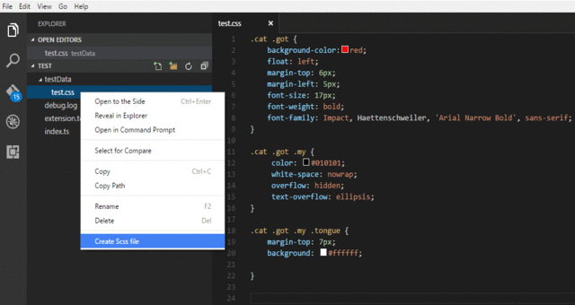

# sass-helper README

Convert your css to scss by extracting mixins and nesting rules and properties in scss files in Visual Studio Code using the *Sass Helper*.

## Features

- Create a scss/sass file with nested rules for an existing css file. (using `sass-convert`)
- Create a sass file for an existing scss file. (using `sass-convert`)
- Nest css rules in a scss file. (using `sass-convert`)
- Nest css properties with same namespace in a scss file.
- Extract a mixin out of selected css properties in a scss file.



## Requirements
Few features of this extension use the `sass-convert` command-line tool which can be installed from http://sass-lang.com/install

## Known Issues

- Extract Mixin feature does not work on nested properties and nested mixins

## Coming Soon

- While extracting mixin, replace all occurances of the selected css properties in the file.
- Nest css properties with same namespace even if they are not contiguous. Example:
```
.hello {
    font-size: 14px;
    float: none;
    font-family: 'Arial Narrow Bold';
    font-weight: bold
} 
```
- Nest css properties with same namespace in the same css rule through out the current file, rather than just the selected ones.

## Release Notes

### 1.0.0

Initial release of the *Sass Helper*


-----------------------------------------------------------------------------------------------------------

